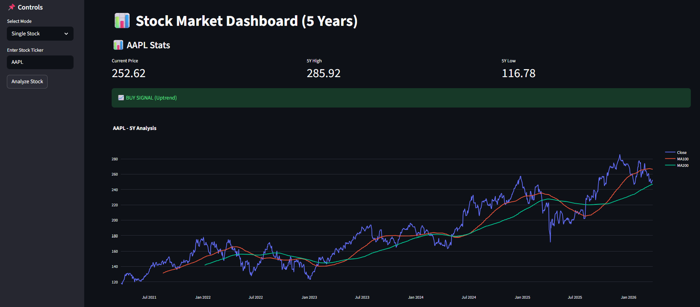

# 📊 Stock Market Dashboard

A Streamlit-based web app to analyze stock market trends using real-time data.

## 🚀 Features
- 📈 5-year stock analysis
- 📊 Moving averages (100 & 200)
- 🔔 Buy/Sell signals
- 📉 Interactive charts (Plotly)
- 🔄 Multi-stock comparison

## 🧰 Tech Stack
- Python
- Streamlit
- Pandas
- Plotly
- yfinance

## ▶️ Run Locally
```bash
streamlit run stockAnalyzer.py


